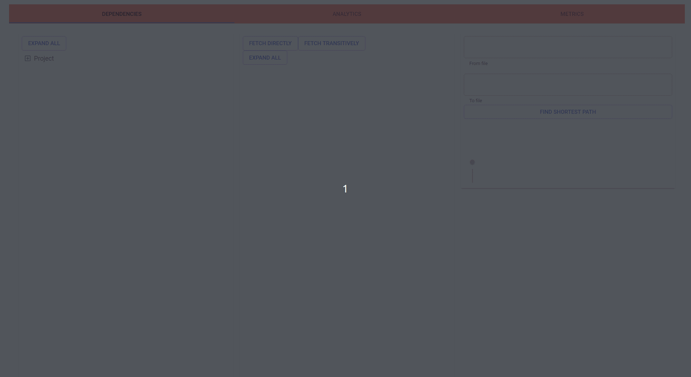
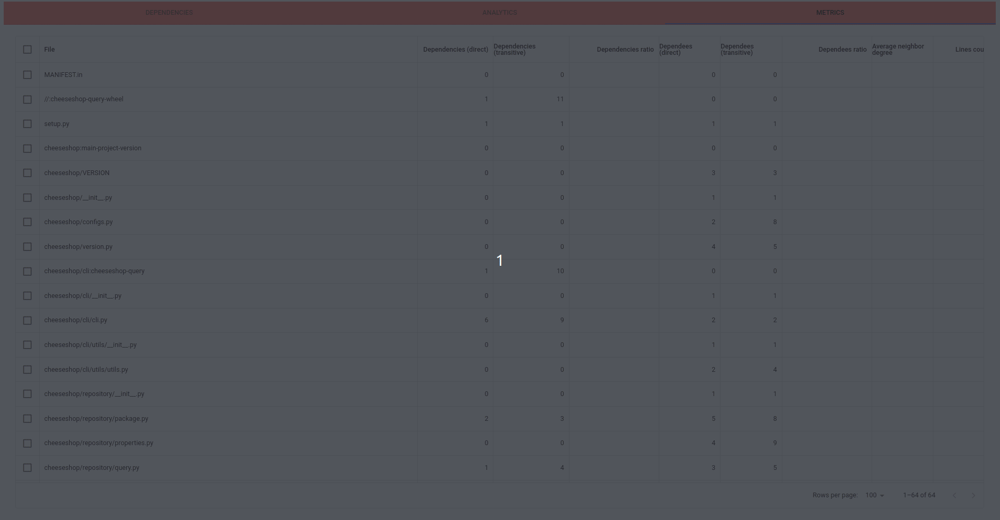

# Overview

A sample implementation of web UI into the dependency graph of a Pantsbuild repository.
This is based on React and Material UI (MUI) React components.

The application provides a UI:

- to explore the direct and transitive dependencies of the dependency graph
- find shortest path between two nodes
- explore and compare the metrics of graph nodes (e.g. number of dependencies and dependents)

## Demo

### Navigating transitive dependencies as directory tree + shortest path



### Exploring metrics for all modules as data grid



## Start server

It would be great to have `networkx` like library in JavaScript,
but using a Python virtual environment with `networkx` pre-installed has minimal efforts.

Prepare a Python virtual environment locally:

```bash
cd server
python3 -m venv .serverenv
source .serverenv/bin/activate
pip install networkx
```

Install `nodejs>=16` on your system and run these commands:

```
cd server
npm init -y
npm i express
npm i cors
```

Start:

```
cd server
npm start
```

## Start client

Install `yarn` on your system and run these commands in the root of the repository:

```
npm install next@latest
yarn add @mui/x-data-grid
yarn dev
```

## Format code

```
yarn prettier --write .
```
